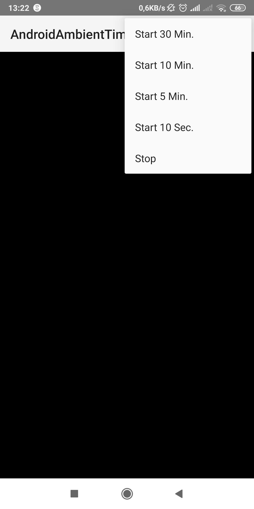
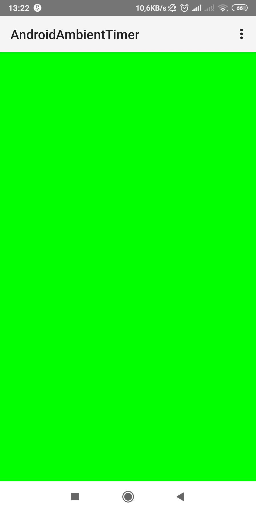
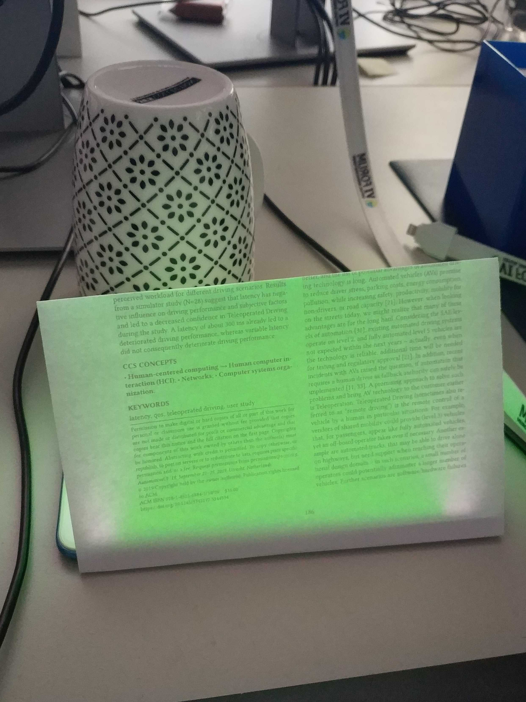

Ambient Timer
===================================
A simple Android App that displays a full-screen color change from green to red for either 30 min, 10 min, 5 min or 10 sec. 
You can place it on the table at full brightness and place something to diffuse the light on top (e.g., a (dry) plastic cup) and have a very basic ambient reminder. 

It is a quick and dirty prototype but a good basis for prototyping some light patterns without having to solder anything. 

Basis: https://github.com/googlearchive/android-BasicImmersiveMode 

Images
===================================
 
 
 
